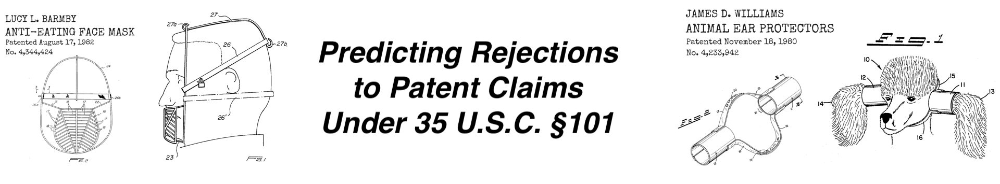
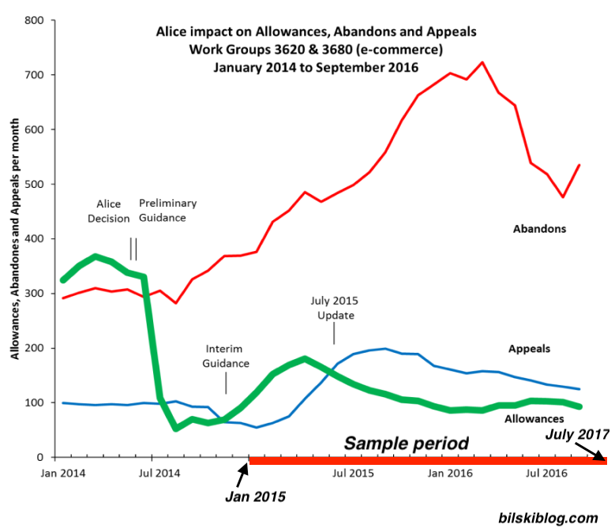
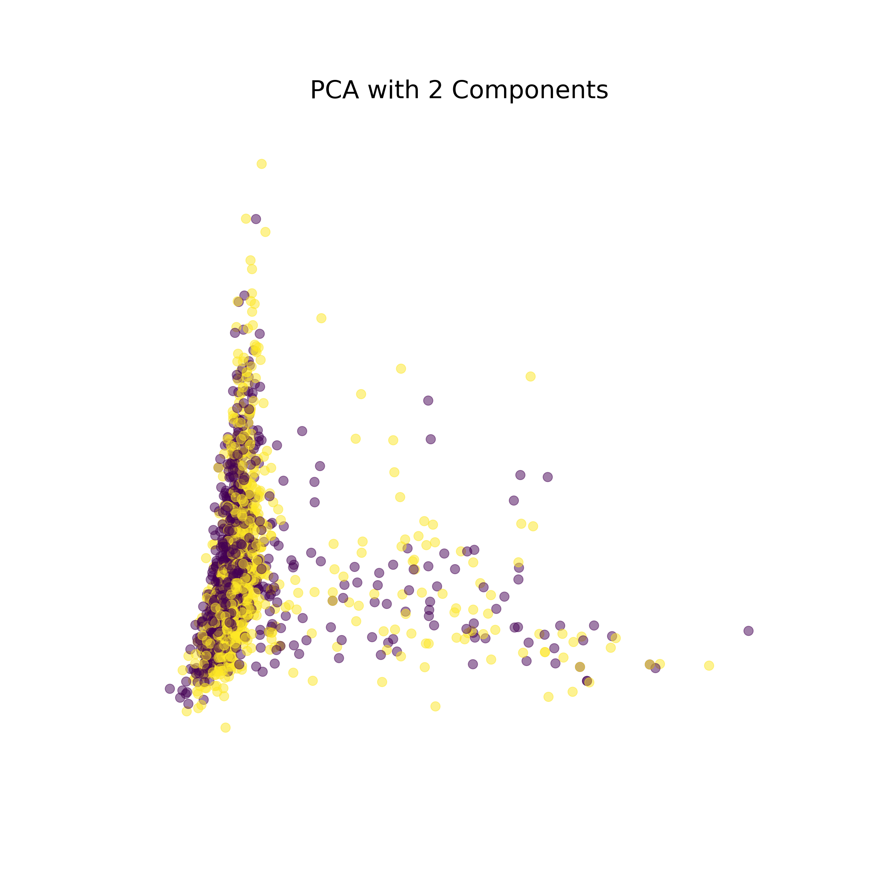

**JOHN HERR | Galvanize Data Science Imersive | Spring 2019** 

# Background & Motivation
In my previous career, I wrote and prosecuted patent applications for tech companies.  For those not familiar with intellectual property law, patents often go through a long and expensive prosecution process before a patent is granted, the Applicant abandons further attempts to patent their invention, or the Applicant appeals their case to the Patent Trial and Appeal Board. Patent examiners at the USPTO review patent applications under the patent laws which are described 35 U.S.C Code § 101, 102, 103, and 112.  Sections 102, 103, and 112  pertain to whether the invention is adequately disclosed in the patent application, and whether the invention is described  in or made obvious by prior art.  U.S.C  § 101 describes what constitutes patent-eligible and patent-ineligible subject matter

In recent years, the Patent Office has had much ambiguity in terms of what is patent-eligible subject matter. Conflicting court decisions and reversals in how the patent office interprests this § 101 continue to make it difficult for inventors to know whether their invention is patentable.  Often during patent prosecution, an Examiner will argue that a patent claim is 'merely an abstract idea.'  To issue a rejection an examiner need only to provide a shaky argument that a claim is too vague, includes operations that could be done mentally, or is merely a combination of well-known computing techniques.  

Applicants often find themselves at the mercy of an examiner who is making the determination whether a claim is patent-eligible under 101.  If a claim is sufficiently narrowed by using precise language or specifying additional features a patent examiner may become comfortable in allowing the application. Having worked in this field, I was curious to see **whether machine learning techniques could be used to help predict whether a claim would be rejected under § 101  for being ineligble subject matter.**

# Data
In late 2017, Google began hosting [Public Patent datasets](https://cloud.google.com/blog/products/gcp/google-patents-public-datasets-connecting-public-paid-and-private-patent-data) on BigQuery. In total, there are 19 datasets, which have been collected by various organizations.  These datasets can be queried using the  [BigQuery API](https://cloud.google.com/bigquery/docs/reference/libraries#client-libraries-install-python) for python.  

For this project, I pulled Office Action data which details the rejections of a patent application from a dataset provided by  USPTO Digital Services & Big Data portfolio, and I pulled claim text from a separate publication dataset provided by IFI CLAIMS Patent Services. Since examination under 101 has been evolving over time, decided to limit my dataset to patent applications that were granted between 2015 and mid-2017.  Since art units within the USTPO often have their own guidance for examining applications, I further decided to narrow my data to applications being reviewed by Art Unit 362 - 'E-commerce,' which has been one of the most difficult to get claims allowed by under § 101.

After pulling the data I ended up with a dataset with the following structure. The first claim both as originally filed in and as patented were extracted using `regex`. The resulting table was ~1300 rows, 25% of which was held out as a test validation set. My python code and SQL query for collecting and unpacking this data can be found in the `/src` folder.

**Application No.** | **Pub. No. As Filed** | **101 rej** | **102 rej** | **103 rej** | **Claims Rejected** | **Pub. No. Granted** |**Claims Allowed**
:-----:|:-----:|:-----:|:-----:|:-----:|:-----:|:-----:|:-----:
US-10148508-A|	US-2008253739-A1| 1| 0| 0| 1. A method….| US-9071730-B2| 1. A method…
...|	

## Example Claim from Dataset Before and After

### Filed claim (Rejected under 101 as an 'Abstract Idea', No art rejections):

1 . A computer implemented method for information editorial controls, wherein a program stored on a non-transitory computer-readable storage medium instructs a processor to perform the method comprising the steps of:
* submitting at least one comment regarding an editorially-controlled content to be published with said editorially-controlled content, said published comment being authored by a contributing member of an online community;  
* entering a rating of said published comment, said rating being determined by at least one reviewing member of said online community;   assigning points within a predefined range for ratings of said published comment that exceeds a predetermined level, said points being assigned to said contributing member by an editor of said online community in which said points identify subject matter expertise for said contributing member; and   
* receiving awarded points in which said awarded points received by said contributing member comprise said points capped by a maximum number assigned to said editorially-controlled content.   
     
         
### Allowed Claim (Added limitations have overcome the 101 rejection): 

1 . A computer implemented method for motivating community members to work with content editors to improve and add to editorially-controlled content, wherein a program stored on a non-transitory computer-readable storage medium instructs a processor to perform the method comprising the steps of:
* submitting to a computer at least one comment regarding an editorially-controlled content to be published with said editorially-controlled content, said published comment being authored by a contributing member of an online community, wherein said published comment is operable to motivate community evolvement toward the evolution and improvement of said editorially-controlled content; 
* a computer generating a rating of said published comment, said rating being determined at least based upon inputs received from one reviewing member of said online community, wherein said computer generated rating is further based on the number of times or length of time said published comment was viewed; 
* a computer assigning points within a predefined range for ratings of said published comment that exceeds a predetermined level, said points being assigned to said contributing member by an editor of said online community in which said points identify subject matter expertise for said contributing member based on a demonstrated knowledge of said contributing member, wherein said computer generated ratings is thereby operable to lessen the work required by said editor and instead utilize members of said online community to identify comments that warrant a review; and 
* a computer assigning awarded points to a contributing member, in which said awarded points received by said contributing member comprise said points capped by a maximum number assigned to said editorially-controlled content, wherein said points earned by said member beyond said capped points for said content is not awarded and recognized to limit points earned by said contributing member. 

# Vectorizing Claims
After acquiring my cleaned data, I vectorized the claim data to use as my feature set. Words in each claim were lemmatized and tokenized to create term frequency matrices and TF-IDF (Term Frequency-Inverse Document Frequency matrices were created for both Train and test datasets). 

# Principal Component Analysis (Assessing Data Structure)
A little bit of PCA confirmed that there was some (weak) structure in the data. The two-dimensional plot below shows the two classes plotted along with the first two principal components. Given that 101 rejections are often  subjective, to begin with, I did not expect a clear delineation between the two classes.

# Naive Bayes Classifier
## Results on Initial Dataset
Given that I had an even split dataset, a Naive Bayes classifier seemd like an appropriate model choice. As of the time of this presentation my trained model turned out to be fairly good!  On my test set of data, the modle proved to be **68.3%** accurate.

Here is a full breakdown:

**_**|**Naive Bayes (using TF-IDF)**
:-:|:-:
Accuracy | 68.3%
Precision  |  69.4%
Recall (TPR) |  65.0%

## Most important features
**Feature**|**abs(Coefficient)**
:-----:|:-----:
of the plurality|5.9
response to|5.88
one of the|5.87
via|5.79
corresponding|5.71
each of|5.71
a second|5.7
response|5.68
being|5.67
computing device|5.66
the second|5.65
the at|5.65
the at least|5.65
one of|5.63
merchant|5.63
on a|5.61
interface|5.6
account|5.6
selected|5.6
be|5.59

## Model Optimization
### What proved to be useful
- Limiting the number of features when creating the TF or TF-IDF matrix. Initially, I had terrible results, as many unimportant features were being used.  These additional features add noise and obscure the signal.  I found that ~150 features seemed optimal.
- Lemetizing the words (~2% improvement in accuracy)
- Adding ngrams (adding feature options for bigrams and trigrams improved accuracy ~3%)
- Normalizing the TF-IDF matrix using the `l1 norm` (Manhattan Distance)
 

### Areas for future Optimization
- Adjusting the prediction threshold for classification to improve the TPR (looking at the ROC curve)
- Identifying appropriate 'stop words.'  Standard 'english' stopwords from `nltk` and `sklearn` did not prove to be helpful. In patent claims I believe many standard stopwords such as 'a' and the 'the' are important. 
- Using more features from the patent application such as application length, date of filing, number of figures, title, etc. 

   
## Validation on Larger Dataset
Without modifiying any model parameters.  I trained and ran the model on a larger dataset from all of the patents that were reviewed by  Technology Center 2100 (Computer Architecture Software and Information Security) during the same period.  In total, this larger dataset compsied of ~15,000 patents.  Since these applications represent patent applications assignedt to multiple art units that make up a technology cetenter within the USPTO, this is somewhat a test to see if the model might be more generalizable. 

**_**|**Naive Bayes (using TF-IDF)**
:-----:|:-----:
Accuracy | 64.3%  
Precision |  71.2%
Recall (TPR) |  50.0%

**Feature**|**Coefficient**
:-----:|:-----:
one of the|6.01
of the plurality|5.97
the at least|5.91
the at|5.91
associated with the|5.88
response to|5.85
the one or|5.85
selected|5.83
are|5.83
stored|5.83
each of|5.82
the one|5.8
being|5.77
to be|5.76
the user|5.75
with a|5.73
by a|5.72
one of|5.71
response|5.7
having|5.7