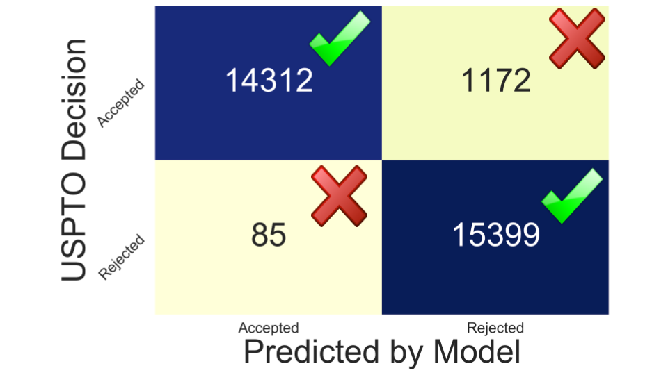
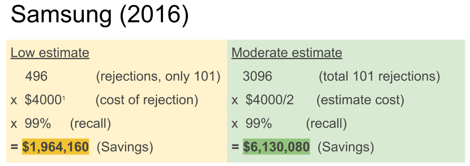

 
## Table of Contents
1. [Background & Motivation](#background)
    - [Example Claims](#claims)
2. [Data](#data)
    - [Training Data and Test Data](#split)
3. [Workflow](#workflow)
4. [Vectorizing Claims](#vector)
    - [Word Embeddings](#word_embeddings)
    - [Claim Embeddings](#claim_embeddings)
5. [Principal Component Analysis](#pca)
6. [Vectorized Features](#features)
    - [Cluster Analysis](#cluster)
7. [Random Forest Classifier](#randomforest)
8. [Results](#results)
    - [Use Cases](#use_cases)

# Background & Motivation 
In my previous career as a patent agent, I wrote and prosecuted patent applications for tech companies. After patents are written, they undergo a review process by patent examiners at the United States Patent & Trademark Office (USPTO). An examiner may issue a rejection of the patent application if they conclude that the claimed invention obvious in view of the prior art, that the claims are directed to include ineligble subject matter, or that the claims are not supported by the specification. After each rejection, the Applicant has a opportunity to ammend the claims to traverse the rejection or present arguments for why they believe the grounds for the rejection are invalid. Each back and forth may cost the  Applicant thousands of dollars and delay the time that the patent will be granted and becomes enforceable.

**The goal of this project was to see if I could utilize machine learning techniques to predict whether a patent claim would be rejected under 35 United States Code § 101, a section of the law that provides criteria for patent-eligible subject matter.**  The code specifies that patents must fall under one of 4 categories: **(1)** a process, **(2)** a machine, **(3)** an (article of) manufacture, **(4)** or a composition of matter. The code further specifies that patents cannot be filed on laws of nature, natural phenomena, or abstract ideas. In recent years the Patent Office has struggled to clearly define criteria for determining whether claims are directed to an abstract idea. Conflicting court decisions have it difficult for practitioners to know what language will be deemed acceptable. Applicants often find themselves at the mercy of an examiner who is making the determination whether a claim is patent-eligible under 101. If a claim can be sufficiently narrowed by using precise language, a patent examiner may become comfortable in allowing the application.

## Example Claims 
Patent claims define the scope of what is being claimed as the invention. While other aspects of a patent may describe the invention, the language used in a claim is what provides a patent owner protection of their invention. If a party infringes on a patent claim, the patent owner can seek infringement damages from the party and force the party from further infringement of the patent.

Below is a randomly selected application ([US9581591B2](https://patents.google.com/patent/US9581591B2/en?oq=+13%2f809%2c288)) from my dataset that shows a claim that was originally rejected under § 101, and then eventually modified to overcome the rejection. In this example, the Examiner argued that "the steps of inputting data, comparing data, and determining the outcome are considered to be an *idea of itself*."  While most claims are not lengthened this much to overcome a rejection, one can see that the allowed claim is much more specific, clarifying items that may not have been clear in the original claim.

<!--  -->
<table class="tg">
  <tr>
    <th class="tg-lboi">Original Claim (Rejected under 35 USC § 101)</th>
    <th class="tg-lboi">Allowed Claim</th>
  </tr>
  <tr>
    <td class="tg-0pky">&nbsp;&nbsp;&nbsp;&nbsp;A computer implemented method of predicting the outcome of a medical procedure on a patient, the method comprising: &nbsp;&nbsp;&nbsp;&nbsp;inputting patient complement cascade data comprising data representing levels of a set of complement cascade markers in said patient at a succession of time intervals following said medical procedure, wherein said patient complement cascade data defines a patient recovery pathway representing an evolution over time of a complement cascade in said patient; &nbsp;&nbsp;&nbsp;&nbsp;comparing said patient recovery pathway represented by said patient complement cascade data with at least one corresponding cohort recovery pathway defined by cohort complement cascade data representing an evolution over time of a complement cascade in a cohort of patients, to determine a deviation between said patient recovery pathway and said cohort recovery pathway; &nbsp;&nbsp;&nbsp;&nbsp;determining a predicted outcome of said medical procedure responsive to said determined deviation.</td>
    <td class="tg-0pky">&nbsp;&nbsp;&nbsp;&nbsp;1. A measuring system for determining infection in a patient who has undergone elective colorectal surgery, the system comprising: &nbsp;&nbsp;&nbsp;&nbsp;a plasmon resonance-based biosensor array for plasmon resonance-based sensing of a plurality of different biological targets simultaneously, the plasmon resonance-based biosensor array comprising a transparent substrate having a surface bearing a plurality of assay spots, a system to flow a sample of bodily fluid of 200 μl or less over the biosensor array; &nbsp;&nbsp;&nbsp;&nbsp;an illumination system to illuminate the biosensor array such that total internal reflection of light at a wavelength at or near a plasmon resonance results in dark-field scattered light modulated by binding of the biological targets,  &nbsp;&nbsp;&nbsp;&nbsp;an image sensor to capture an image of the dark-field scattered light from the biosensor array, a processor, coupled to the image sensor, to working memory, and to program memory storing control code to process image data from the image sensor such that data from the plurality of different biological targets is acquired within a time duration of less than 60 minutes; and &nbsp;&nbsp;&nbsp;&nbsp;a user interface; &nbsp;&nbsp;&nbsp;&nbsp;wherein the control code further comprises code to: &nbsp;&nbsp;&nbsp;&nbsp;process the image data to determine patient complement cascade data from the sensed plurality of different biological targets, the complement cascade data comprising data representing levels of a set of complement cascade markers in the patient at a succession of time intervals following the surgery,  &nbsp;&nbsp;&nbsp;&nbsp;wherein the patient complement cascade data defines a patient recovery pathway representing an evolution over time of a complement cascade in the patient, and  &nbsp;&nbsp;&nbsp;&nbsp;wherein the set of complement cascade markers comprises at least proteins C3 and C4 and one or more complement fragment biomarkers derived therefrom; &nbsp;&nbsp;&nbsp;&nbsp;compensate for dilution of levels of the complement cascade markers using at least one of the complement fragment biomarkers; &nbsp;&nbsp;&nbsp;&nbsp;compensate levels of the complement cascade markers for a background or pre-existing activation of the complement cascade in the patient; &nbsp;&nbsp;&nbsp;&nbsp;repeatedly measure levels of the set of complement cascade markers over time to define a set of at least two curves representing evolution over time of levels of the proteins C3 and C4 or complement fragment biomarkers derived therefrom; &nbsp;&nbsp;&nbsp;&nbsp;determine whether the patient is infected by comparing a fit of the at least two curves to corresponding curves representing an evolution over time of a complement cascade in a plurality of patients; and  &nbsp;&nbsp;&nbsp;&nbsp;output a result of the comparing to the user interface to enable a user to determine infection in a patient who has undergone elective colorectal surgery.</td>
  </tr>
</table>

# Data 
In late 2017, Google began hosting [Public Patent datasets](https://cloud.google.com/blog/products/gcp/google-patents-public-datasets-connecting-public-paid-and-private-patent-data) on BigQuery. In total, there are 19 datasets, which have been collected by various organizations.  These datasets can be queried using the  [BigQuery API](https://cloud.google.com/bigquery/docs/reference/libraries#client-libraries-install-python) for python. I collected Office Action data providing information on patent rejections from USPTO Digital Services & Big Data portfolio, and I pulled claim text from a dataset provided by IFI CLAIMS Patent Services. Since examination under § 101 has been evolving, I decided to limit my dataset to patent applications granted between 2015 and mid-2017.

For each application in my dataset, I considered the first claim as originally filed, which was rejected under § 101, and the first claim as granted. The raw claim text was extracted using regular expressions.  After this initial cleaning and preprocessing step, I had a dataset with the following structure.

**Application No.** | **Pub. No. As Filed** | **101 rej** | **102 rej** | **103 rej** | **Rejected Claim** | **Pub. No. Granted** |**Granted Claim**
:-----:|:-----:|:-----:|:-----:|:-----:|:-----:|:-----:|:-----:
US-10148508-A|	US-2008253739-A1| 1| 0| 0| 1. A method….| US-9071730-B2| 1. A method…
...|

## Training Data and Test Data 
I wanted to test my model on never seen before claims, so I first split the applications into a training set and a holdout test set. As each patent application that I considered had an originally filed claim that was rejected under § 101 and a claim that was eventually granted, both my training and test datasets where inherently balanced having an equal number of rejected and accepted claims.

# Workflow 
Now that you hopefully have a general understanding of the data and the problem I am trying to address, it seems appropriate to give a quick overview of the workflow that I used, which is illustrated below.

First, raw patent text and was pulled using Google Big Query and the Python API. I only considered patent applications where the first independent claim initially received a 101 rejection but was eventually granted. Generally, if a patent application has § 101 is issues, the rejection will apply to the first independent claim, but this is not always the case.  To ensure I was looking at claims that were rejected under § 101, I further limited my query to applications recieiving a first rejection where  no claims were deemed allowable and where no art rejections were provided.

After pulling the raw claim text, I performed some data cleaning & preprocessing using `Pandas` and  `Numpy.` `Regex` commands were used to extract the first independent claim for each patent application.  Next, to extract features from the claims, I created a claim vector for each claim in the dataset using the Doc2Vec in the `gesim` module (more on this below).  Finally, after vectorizing the claim text, a Random Forrest Classifier was trained on the training data and used to predict whether claims the holdout test dataset would receive a rejection under § 101.

# Vectorizing Claims 
Traditional approaches to natural language processing often involve counting the frequency of terms or phrases in a document.  This generally involves generating a term frequency matrix or a TF-IDF (term frequency inverse document frequency) matrix for each document in your dataset. While this straightforward approach has proven to be very useful for certain applications - this method suffers from two major pitfalls.  First, with the exception of using 'n-grams', where multiple words are considered as a single term, the ordering of words is lost. Second, this approach does not account for the semantic meaning of a word. In the first iteration of this project, I attempted this conventional approach but found that my model was only a little better than guessing. Having a mediocre baseline, I decided to try to make use of word embeddings.

## Word Embeddings 
Word embeddings encode the semantic meaning of a word into a vector.  Words that have similar meanings will have similar vectors. Using the `Word2Vec` algorithm from 	`gensim`, semantic meaning can be learned by recognizing patterns in the words and phrases that come before and after use of the word.

The diagram below shows the structure of the Word2Vec algorithm. The single hidden layer in the fully connected neural network includes linear neurons. The input layer and the output layer are set to have as many neurons as there are words in the vocabulary for training. The size of the hidden layer is set to the dimensionality of the resulting word vectors, and the weights of the 'W' matrix and 'W1' matrices are determined when training. The 'W' matrix includes the N-dimensional word vectors (or word embeddings), and the 'W1' matrix is used for decoding the dense hidden layer. As I am only briefly touching on how the model works here, I would recommend looking at [paper](https://arxiv.org/pdf/1301.3781.pdf) by Mikolov at Google who developed this method.

Training the word embeddings in the 'W' matrix involves iterating through each word of a large corpus of training text. A single training operation of a word vector involves one hot encoding the contextual words of an instance of the word as it appears in the training text and determining the probability of the word in the softmax layer. The error, *1-probability(correct word)*, is then used to update the weights that make up the word embeddings through stochastic gradient descent.

As an illustration, in the phrase "the cat **climbed** a tree", the words 'the', 'cat', 'a', and 'tree' are used in training the word embedding for **climbed**. Ideally, once the model is sufficiently trained, the probability of the correct word will be higher than every other word in the dictionary.

Preferably, the embedding of each word will be trained by seeing many different contexts of how the word used, so that a meaningful word embedding can be determined. When training my model, I trained word vectors for the 2,000,000 most frequent words appearing in English Wikipedia articles (V=200). I further set the length of the hidden layer to 300 (N=300), which means my resulting word vectors exist in a 300-dimensional 'word space.'

The power of word embeddings really became apparent to me when I saw how certain directions in the n-dimensional word space could pick up unique semantic distinctions.  As illustrated by the above figure (taken from the Tensorflow website), certain directions in the 'word space' can be associated with semantic relationships such as between male-female differences, verb tense differences, and even country-capital relationships (see also [Mikolov](https://arxiv.org/pdf/1301.3781.pdf) et al., 2013).

To test out the accuracy of the learned word embeddings, I performed a handful of vector operations on my trained word embeddings as a sanity check.  For example, `Word2Vec` has a function that returns the Words in the dictionary that have the highest cosine similarity to a point in the 'word space. As one example, I queried for the closest word to **'king'-'man'+'woman'** and saw the top results (see table below) being remarkably in line with what one might expect.  The first time I saw this, I was blown away to see that the Word2Vec algorithm could accurately pick up on these semantic relationships.

**Top Results**|**Cosine Similarity**
:-----:|:-----:
Princess|0.65
Queen|0.65
Kingdom|0.64
Prince|0.64
Throne|0.63
Husband|0.61
Princesses|0.61
Wife|0.60

** Note: All of the results shown herein are actually reflective of pre-trained word embeddings that I found on [jhlau's github page](https://github.com/jhlau/doc2vec). I trained my own Doc2Vec model on the Wikipedia Corpus and achieved good results, but I saw about a 20% improvement in accuracy when using the pre-trained word embeddings. It appears that jhlau followed a similar process in training, albeit with slightly different hyperparameters. Given that my model took nearly two-days to train on a 32-core EC2 instance, I decided to rely on the pre-trained embeddings in the linked model for this project.

## Claim Embeddings (more commonly known as document or paragraph embeddings) 
Once you understand the concept of word embeddings, the concept of claim embeddings is only one additional step. Here is the architecture of the `Doc2Vec` model.

N-dimensional claim embeddings are then trained by making use of the pre-trained word embeddings. The training operation is similar to that described previously. In training a claim embedding, the algorithm goes through the words in the claim iteratively, firing off the contextual words to have the softmax layer hopefully predict the word in question. The only differences in the Doc2Vec model is (1) we are no longer updating the weights in the 'W' and 'W1' matrices, and (2) we are extending the input layer by the number of claims that we are learning embeddings for. The claim embeddings are the rows of the 'D' matrix which are concatenated onto the 'W' matrix. The error during each training operation is then used to update weights for the values in the 300-dimensional claim embeddings.

Claim embeddings are basically vectors that contain information to predict a word given a set of contextual words. As such, I believe these embeddings contain information for determining 'abstractness.' For example, a first claim embedding might suggest vague langue language for a given set of contextual words, while a second claim embedding might suggest much more concrete language for the same set of contextual words.

Example:
* Contextual words: "a flow rate sensor  _________ one end of the vessel."
* 1st claim embedding (Vague language): "a flow rate sensor __near__ one end of the vessel."
* 2nd claim embedding (Concrete language): "a flow rate sensor __mounted (to)__ one end of the vessel."

# Principal Component Analysis (Assessing Data Structure) 
After having inferring document vectors for each claim in my test dataset, I was curious to verify what sort of structure my data had. I plotted the first three principal components (shown in the animation below). Frankly, I was quite surprised at the strong signal I observed.  While clearly not perfect, there is an easily observed distinction between the two classes of rejected claims (RED) and allowed claims (BLUE).  

# Investigating Vectorized Features 
A downside of using the vectorized claim data is that interpretability becomes much more difficult. For example, it is difficult to explain why a particular claim might be rejected or allowed using vectorized features. The following analysis is just a little bit of the work I did to try and understand what aspects of a claim were being encoded into the claim embeddings, and whether there were particular dimensions in the 300-dimensional 'claim space' that seemed important for classification.

For this analysis, I only considered claims from a single art unit within the USPTO (art unit 2100). I initially looked at the mean value for the each of the 300  dimensions for each category, and found that for most features, the values were pretty similar, but that there were a handful of dimensions which appeared to be particularly helpful in distinguishing between accepted and rejected claims.

## Cluster Analysis 
To better understand what features that were being extracted from the claims during vectorization, I did k-means clustering on the claim embeddings to group the claims into 30 clusters. Note, cluster numbers were re-ordered by the percentage of claims that were rejected in each cluster. As can be seen, there are a handful of clusters that were responsible for identifying most of the rejected claims.

U.S. patents are hand classified into technology groupings based on the subject matter of the claims. I was curious to see whether these clusters were picking up on the technology grouping, and to some extent, they are.  For example, cluster 26 appears to have captured mostly claims in the group for "*presentation processing of document, operator interface processing, and screen saver display processing*." The granted claims in this same category appear to be mainly captured by clusters 6, 13, and 16.

I also looked for some trends that I would have expected to see from my experience writing patents.  As I would have expected, rejected claims tend to be shorter than the allowed claims.  This is seen in the clustering shown, although this is not always the case.  Similarly, rejected claims tend to use fewer narrowing or clarifying phrases such as *corresponding to...*, *each...*, *responsive to...*, *containing...*, *only...*, *using the...*, *a first...*, *consisting...*, *more than...*, and *between...* that are commonly used in patent language.

# Random Forest Classifier 
Having vectorized my claim data, I chose to use a random forest classifier to provide the final prediction for whether a claim is accepted or rejected.  A simplified diagram of a random forest classifier is shown below.  In short, multiple decision trees are generated (I used 100 trees) and the majority voting of each of the trees is used to for the final prediction.  The trees are relatively uncorrelated and distinct because each decision node of the trees is made from a randomly selected subset of the 300 features.

# Results 
The classifier was trained on my training dataset of ~120,000 claims and tested on the holdout test set of ~30,000 claims. The model has proven to be quite accurate with an overall accuracy of 95.9%.  More importantly 99% of the claims that were rejected under 101 were correctly identified.

**Accuracy: 94.6%**

**Rejected claims identified (Recall): 99%**

## Use Cases 
There are a handful of uses cases for a model like this.  First, patent examiners at the USPTO could use this model to help identify claims that should be rejected.  In another instance, patent attorneys and patent agents could use a model as a second set of eyes when they are drafting patent claims. Finally, large companies that partner with outside law firms could use a tool like this to approve or reject claims that have been prepared by the law firm.

Now you might be wondering how often these §  101 rejections are issued, and what the business value of a model like this would be. To investigate this, I looked at the rejections that were issued to Samsung in 2016.  In that year alone, they received 3,096 rejections under § 101.  In 496 of those rejections, the Office Action did not provide any other grounds for rejection, meaning that the application would have likely been granted right away had only more clear language been used.  As shown by the quick estimates below, Samsung could have saved quite a bit of money had they simply not approved any claims for filing that the model did not approve.  The true value is likely even higher than these back of the envelope estimates when you account for the savings in management of patent portfolios and the fact that patents that are allowed more quickly can also be enforced sooner.

I hope you have found this project to be as interesting as I have.  I plan to keep developing working on this project. In the meantime, if you have any feedback feel free to connect over [LinkedIn](https://www.linkedin.com/in/johnrherr/).
